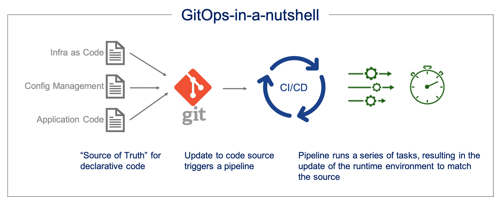

# Introduction

Deploying web applications can be complex and confusing due to varied approaches and additional tasks. While services, containers, and CI/CD environments can enhance the process, the lack of documentation from developers about their deployment steps can still lead to confusion among team members. This guide establishes a deployment strategy for small software development teams, inspired by GitOps methodology, aiming to simplify the deployment process and execute it systematically and efficiently.

_With this approach, the team will achieve:_

- Collaborative Deployment Workflow

> Centralized repository for team contributions, sharing strategies, and resolving issues collectively.

- Streamlined Deployment Process

> Clear instructions, scripts, and best practices for minimizing downtime and ensuring smooth transitions.

- GitOps Documentation

> Git repositories as a single source of truth for version-controlled infrastructure and deployment files.

## GitOps Methodology

Before delving into the details, it's important to note that we will base our approach on GitOps methodology, commonly used in larger teams for managing infrastructure and application deployment through version control systems. However, we will adapt this methodology to a smaller scale, leveraging its benefits for smaller teams.

